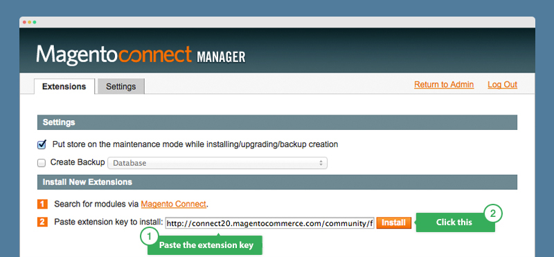
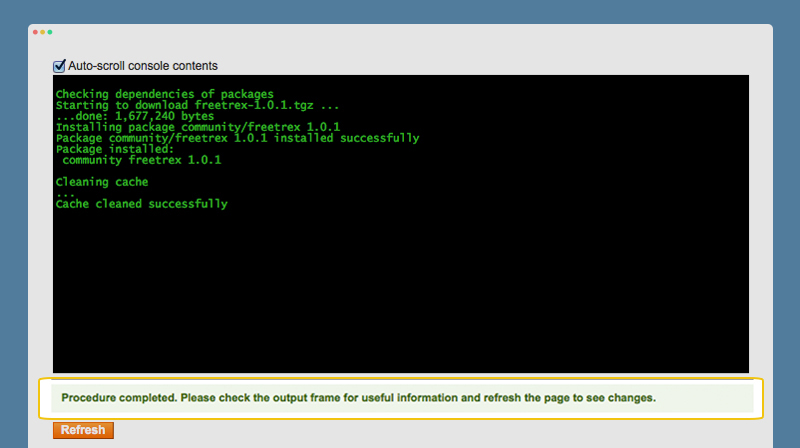

# Tooso Search for Magento

[Tooso](http://tooso.ai) is a cloud-based, multi-language search tool for e-commerce.

This extension replaces the default search of Magento with a typo-tolerant, fast & relevant search experience backed by [Tooso](http://tooso.ai/Default.aspx).

## Facts

- version: 1.0.0
- extension key: Bitbull_Tooso
- [extension on Magento Connect](http://www.magentocommerce.com/magento-connect/tooso-search.html)
- Magento Connect 2.0 extension key: http://connect20.magentocommerce.com/community/Bitbull_Tooso
- [extension on GitHub](https://github.com/bitbull-team/Bitbull_Tooso)
- [direct download link](http://connect.magentocommerce.com/community/get/Bitbull_Tooso-1.0.0.tgz)

## Description

This extension replaces the default Magento search engine with one based on Tooso API.
It provide the following features:

* Fulltext search for catalog products (currently advanced search is not supported)
* Scheduled indexing of catalog products
* Automatic typo correction
* Search keywords suggest

## Requirements

The only requirement for the module is the default Magento cronjob execution correctly configured.
Something like the following is a good configuration:

```
*/5 * * * * php -f /absolute/path/to/magento/cron.sh > /dev/null 2>&1
```

This will run the Magento jobs schedule and executions every 5 minutes. *Note:* the Tooso indexing flow start every 15 minutes.

Here is some additional info on how to add cron jobs with Cpanel and Plesk, which are some of the most popular web panels:

* [CPanel - Add a cron job](https://documentation.cpanel.net/display/ALD/Cron+Jobs#CronJobs-Addacronjob)
* [Plesk - How do I set up cron jobs](https://www.interspire.com/support/kb/questions/382/How+do+I+set+up+CRON+on+my+server+using+Plesk%3F)

If you can't access your server configuration, please ask your hosting provider to configure crontab for you.

## Installation Instructions

You can install the extension with following methods:

### Through Magento Connect

1. Log in to your Admin Panel, navigate through System -> Magento Connect -> Magento Connect Manager, then login to the Magento Connect Manager with your admin username and password:

2. In the Extension tab >> Install New Extensions, paste the extension key into the install field and click **Install** button:

3. The "Extension dependencies" appears: your package is in Ready to install status. Click to **Proceed**:

4. Wait untill you get the successful installation notification:

5. Click Refresh to finish.

### Copying files manually

Copy all files and directories recursively from `src` directory into your document root.

### Using Composer

If you use [Composer](https://getcomposer.org) for manage your module dependencies, you can install the module adding this repository to your `composer.json` file:

```
{
    "repositories": [
        {
            "type": "vcs",
            "url": "https://github.com/bitbull-team/Bitbull_Tooso"
        }
    ]
}
```

Then you can add the module dependency:

```
{
    "require": {
        "magento-hackathon/magento-composer-installer": "*",
        "bitbull/magento_tooso": "1.0.0"
    }
}
```

Finally, you can launch the command `composer update` inside your project root directory.

Regardless the method you choose, after installation you need to clear the cache and logout from the admin panel and then login again.

## Module Configuration

1. Access the extension configuration under System -> Configuration -> Tooso Search Engine.
2. Insert your API key into __API key__ field under __API Configuration__ and enable Tooso Search setting to __Yes__ the field __Enable Search__ under __Active Tooso__.
3. If you are in the Early Adopter phase, it's highly advisable to leave enabled __Send report__ and __Force logging__ configurations under __API Configuration__. This will give to the Tooso support team more information for help you troubleshoot in case of errors.
**Please note:** to be able to send report to Tooso, your Magento installation need to be able to send email.

## Customize reindex flow

By default, the catalog reindex process start every 15 minutes. This is done through the standard Magento cron framework (more info [here](http://www.webguys.de/magento-1/tuerchen-08-magento-cron-demystified)).
You can customize the frequency of reindex schedule editing the file `app/code/community/Bitbull/Tooso/etc/config.xml`:

```
    <crontab>
        <jobs>
            <tooso_reindex>
                <schedule>
                    <cron_expr>*/15 * * * *</cron_expr>
                </schedule>
                <run>
                    <model>tooso/observer::rebuildIndex</model>
                </run>
            </tooso_reindex>
        </jobs>
    </crontab>
```

you can change the value of node `<cron_expr>` using any standard [cron expression](https://en.wikipedia.org/wiki/Cron#CRON_expression).